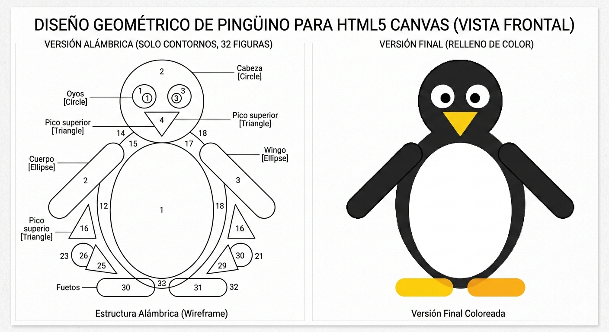

# 🐧 Pingüino Geométrico con API Canvas

## 📚 Examen Tema 1— Introducción a la Graficación por Computadora

---

## 📌 Información Académica

- **Alumno:** Jesús Nicolás Vite  
- **No. Control:** 241064039  
- **Carrera:** Ingeniería en Sistemas Computacionales  
- **Materia:** Graficación  
- **Docente:** M.C. Pinedo Fernández Víctor Manuel  
- **Año:** 2026  

---

## 🎯 Descripción del Proyecto

Este proyecto consiste en la construcción de un **pingüino geométrico** utilizando la **API Canvas 2D de HTML5**, aplicando principios fundamentales de la graficación por computadora mediante figuras geométricas básicas.

### Requisitos del examen:

- Uso obligatorio de API Canvas  
- Mínimo 30 figuras geométricas  
- Organización estructurada del código  
- Aplicación de buenas prácticas  

El resultado final supera ampliamente el mínimo requerido.

---

## 🖼 Imagen de Referencia

Se utilizó la siguiente imagen como guía visual inicial:

> La imagen fue generada como apoyo conceptual utilizando **Gemini**, sirviendo únicamente como referencia visual base.

---

## 🎨 Modificaciones y Aportes Propios

Aunque se partió de una referencia visual, el diseño final fue modificado manualmente agregando elementos propios:

- 🎀 Moño decorativo (3 figuras)
- 🐤 Pico estructurado en capas (figuras exteriores e interiores)
- 🧊 8 cubos de hielo añadidos manualmente
- 🌫 Sombras decorativas
- Ajustes proporcionales y centrado dinámico

El resultado final es una reinterpretación geométrica personalizada.

---

## 📊 Conteo Total de Figuras en `main.js`

El mínimo requerido era de **30 figuras geométricas**.

Después del análisis del archivo `main.js`, el proyecto contiene aproximadamente:

# 🔢 47 figuras geométricas individuales

### Desglose aproximado:

| Elemento | Cantidad |
|----------|----------|
| Patas (roundRect) | 2 |
| Cuerpo (ellipse) | 1 |
| Alas (ellipse rotadas) | 2 |
| Vientre | 1 |
| Cabeza | 1 |
| Ojos (externos + pupilas + brillo) | 6 |
| Moño (2 triángulos + 1 círculo) | 3 |
| Pico exterior | 2 |
| Pico interior | 2 |
| Sombras elípticas | 6 |
| Cubos de hielo | 8 |
| Figuras adicionales y detalles | ~13 |

✔ Se supera el mínimo requerido por más de 15 figuras.

Cada figura fue creada manualmente utilizando métodos de la API Canvas como:

- `beginPath()`
- `arc()`
- `ellipse()`
- `rect()`
- `roundRect()`
- `moveTo()` y `lineTo()`
- `fill()` y `stroke()`
- `translate()` y `rotate()`

---

## 🛠 Tecnologías Utilizadas

- HTML5  
- CSS3  
- JavaScript  
- Bootstrap 5  
- API Canvas 2D  
- Git  
- GitHub  

---

## 🤖 Apoyos Tecnológicos

Durante el desarrollo se utilizaron herramientas de asistencia como:

- ChatGPT → Apoyo en documentación y estructura.
- Gemini → Generación de imagen conceptual base.

Estas herramientas fueron utilizadas como soporte académico y no como sustitución del desarrollo manual del código.

---

## 🏗 Estructura del Proyecto
│
├── index.html
├── assets
│ ├── css
│ │ └── styles.css
│ ├── js
│ │ └── main.js
│ └── img
│ └── imagen.png

---

## 🚀 Ejecución

1. Clonar el repositorio:
git clone https://github.com/jesusvittee/examen-api-canvas

2. Abrir `index.html` en el navegador.

No requiere servidor ni dependencias adicionales.
